# Digital Coral

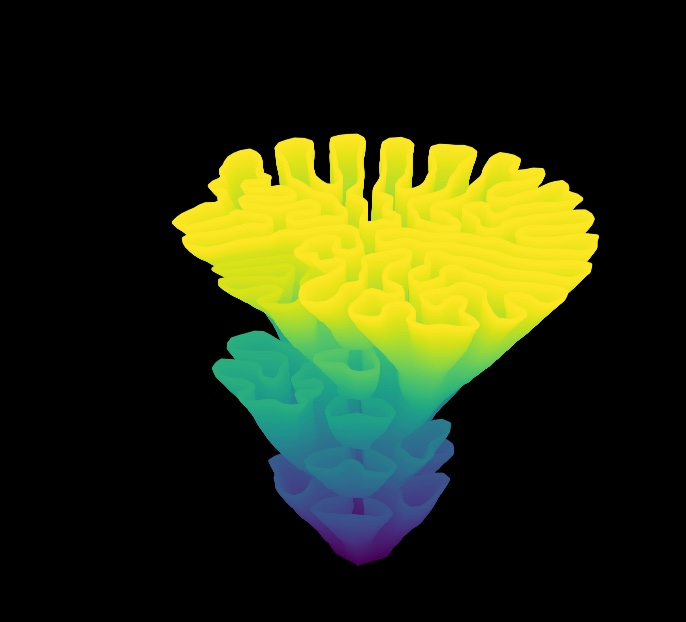

*TL;DR: Python repository using differential growth to generate coral-like 3D shapes. This work aims to imitate [Urban Reef](https://www.urbanreef.nl/) algorithms. The algorithm differs in some ways from the basic differential growth.*

A few years ago I came across the work done by [Urban Reef](https://www.urbanreef.nl/). They create coral like 3D shapes with algorithms that imitate natural process. This fascinating sculptures are then 3D printed using a sort of ceramic which can support the growth of plants. These 3D printed shapes can have numerous applications in urban settlements. 

I settled out to imitate the urban reef algorithms. I started from [this yotube tutorial](https://www.youtube.com/watch?v=hPjblxA09ZI) from [Programming Chaos](https://www.youtube.com/@programmingchaos8957) about differential growth. I realized that stacking up the different stages of the differential growth would have given me a 3D shape. I vectorized operations as much as possible to speed them up. To make the 3D shape less symmetrical I added an operation comperable to the one of pruning. I provided different ways to plot the generation process and the 3D end result.

**Repository structure:**
- */notebooks*, folder with two notebooks, one with the first basic version of differential growth which tends to be symmetrical, the other with the random pruning.
- */pictures*, folder with examples of the output.

**Disclaimer - future work**
I think the code should be rewritten in a much cleaner way and there should be a clear documentation on how to set up an enviroment to run this code. I created some github issues about this. However, this being a fun-project, I am not sure when I will get around to do this. 

Feel free to reach out if you want to collaborate. It would be amazing if someone could print some of these shapes perhaps on biodegrdable material!

**Gallery**

    

        
    

    

        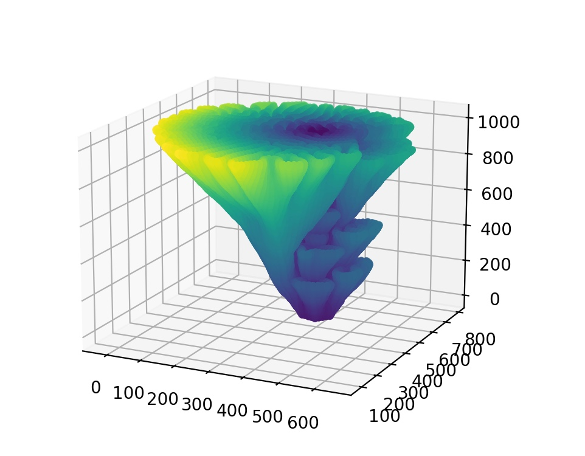
    

    

        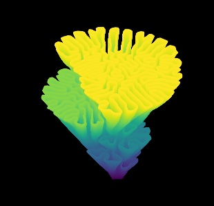
    

    

        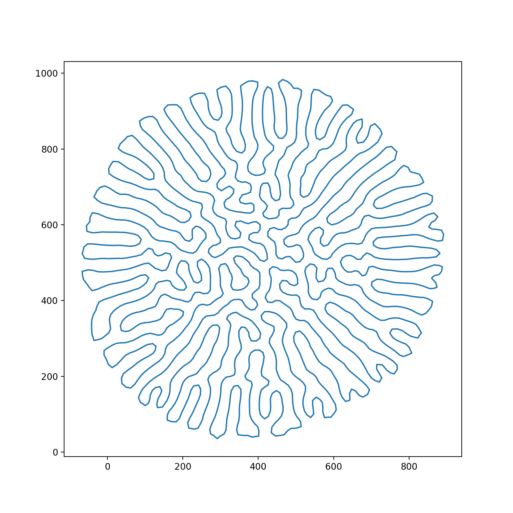
    

    

        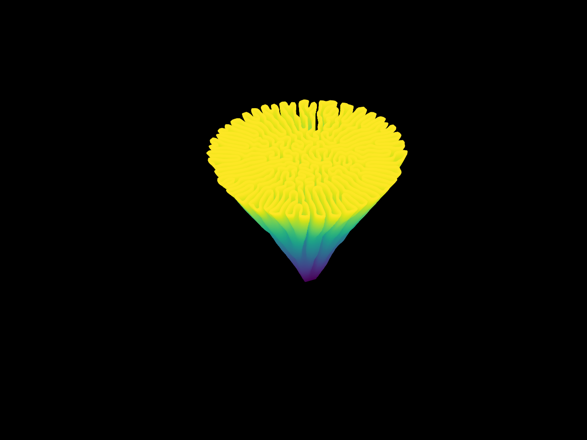
    

    

        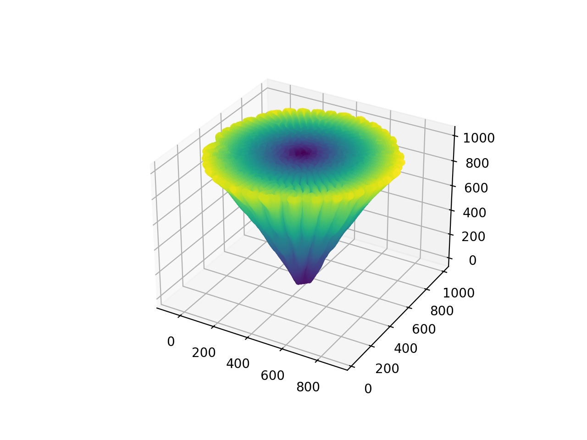
    

    

        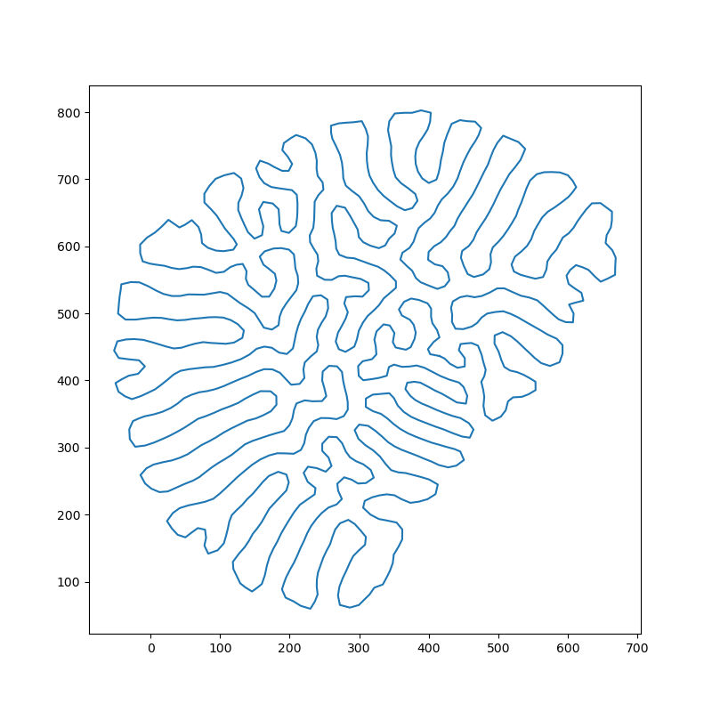
    

    

        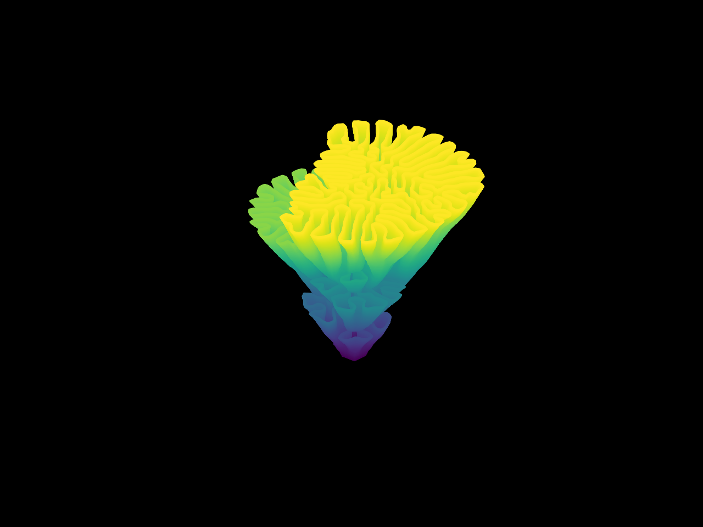
    

    

        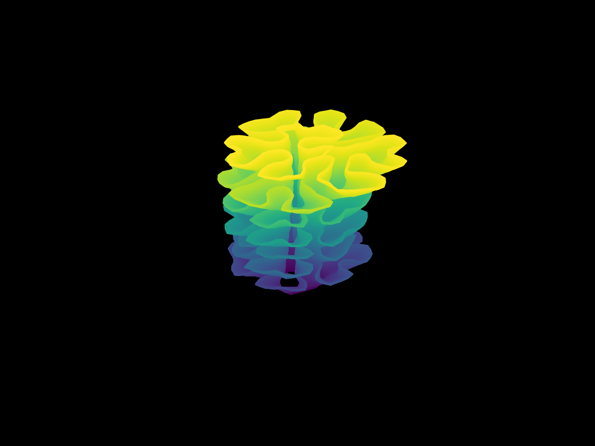
    

    

        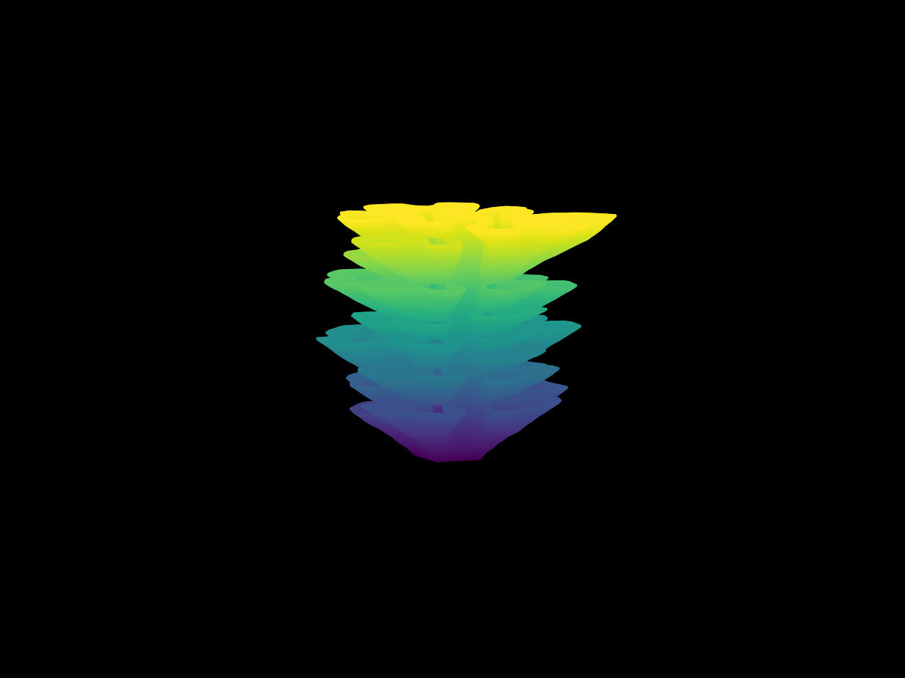
    

    

        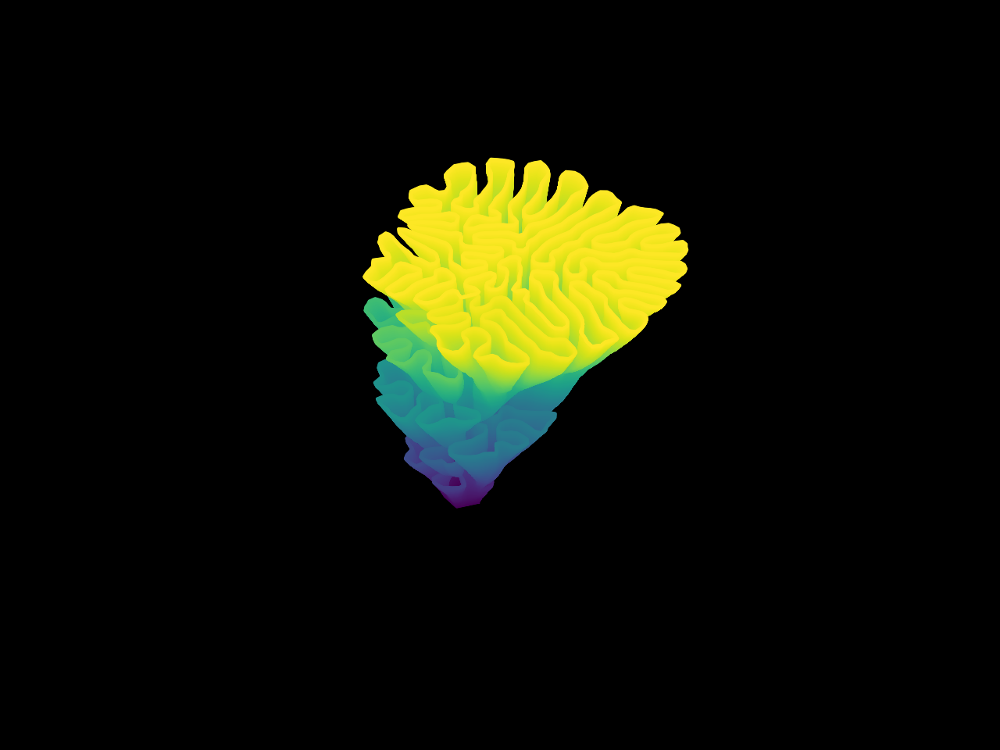
    

    

        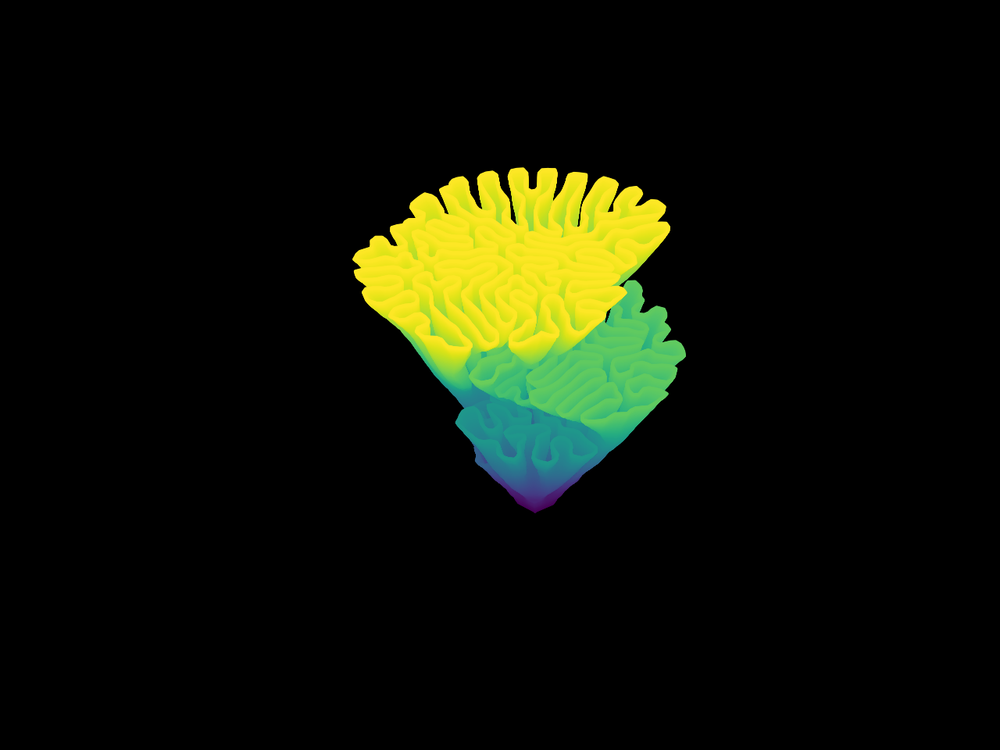
    

    

        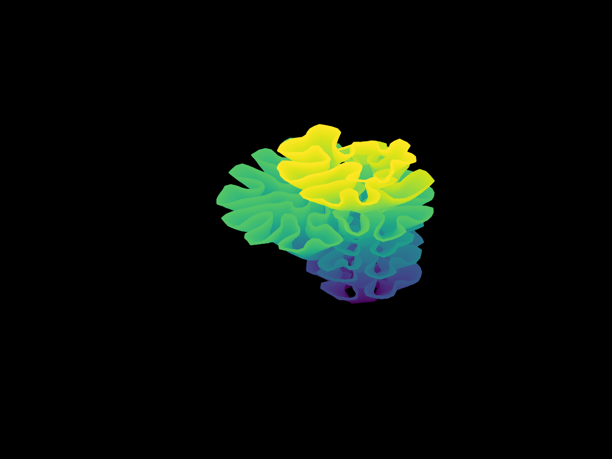
    

